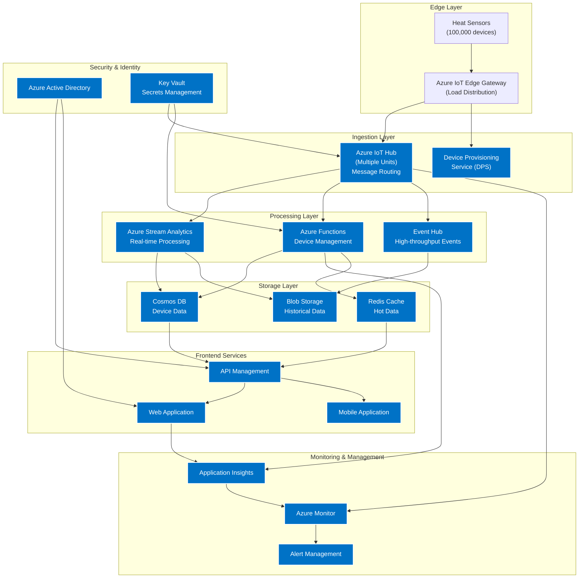
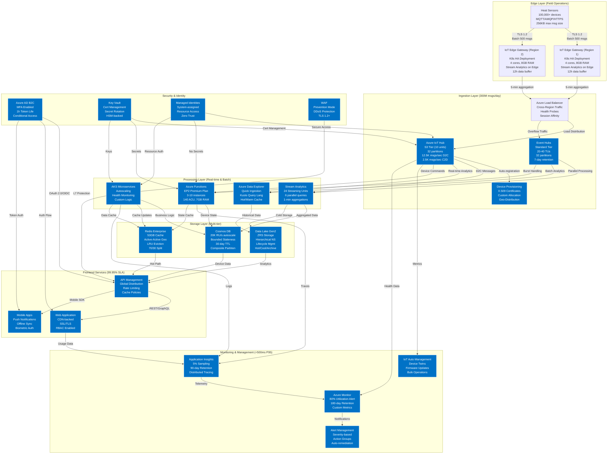

Please provide an Azure cloud architectural design diagram for a bidirectional IoT service supporting 100,000 heat sensor devices. Each sensor transmits 3,000 key-value pair measurements, and users must be able to monitor and manage all devices.

Below is a revised diagram with added or adjusted components to enhance scalability, performance, and reliability. The main changes and reasoning are:

1. **Distributed Edge Layer**  
   - Multiple Azure IoT Edge Gateways or clusters for balancing load across geographies or high-density sensor clusters.  
   - Consider using edge computing (e.g., Stream Analytics on IoT Edge) for initial data filtering/compression.

2. **Scaled Ingestion Layer**  
   - **IoT Hub in Multiple Capacity Units** to handle higher throughput (partitioning telemetry).  
   - **Optional Load Balancer** in front if you have multiple IoT Hub instances or if you plan a multi-hub approach.  
   - **Azure Event Hubs** for parallel ingestion of high-volume data (in addition to or instead of IoT Hub for certain data flows).

3. **Flexible Processing Layer**  
   - **Azure Functions** with **Premium or Dedicated Plans** to handle bursts of device commands or management requests.  
   - **Azure Stream Analytics** or **Azure Data Explorer** to handle real-time analytics, enabling quick ingestion (millions of events/sec) and fast queries.  
   - **Containerized Microservices (AKS)** if you need custom business logic or more controlled scaling.

4. **Optimized Storage Layer**  
   - **Cosmos DB** with carefully chosen partition key (e.g., device ID) for unlimited horizontal scaling.  
   - **Data Lake (ADLS Gen2 or Blob)** for historical or large bulk data with hierarchical storage.  
   - **Redis Cache** (or Azure Cache for Redis Enterprise tiers) for ultra-fast reads of "hot" data.  

5. **Robust Security & Identity**  
   - **Azure AD** for user and service principal management.  
   - **Managed Identities** for accessing Key Vault, Storage, etc., removing secret management overhead.  
   - **Key Vault** for securing secrets, certificates (especially for IoT Edge/Hub).

6. **Comprehensive Monitoring & Management**  
   - **Azure Monitor & Application Insights** for collecting logs, metrics, and traces across all services.  
   - **Azure IoT Hub Automatic Device Management** for firmware updates and device twin synchronization at scale.  
   - **Alerts** on both system-level (latency, ingestion rate) and application-level metrics (exceptions, custom events).

7. **Frontend Services**  
   - **API Management** auto-scaled across multiple regions to handle user requests globally.  
   - **Web & Mobile Apps** behind a CDN or Traffic Manager for globally distributed users.  
   - **Role-based Access Control (RBAC)** integrated with Azure AD for secure device management.

---

### Improved Flowchart
Use visual studio code extension: bierner.markdown-mermaid

---

### Key Scalability & Performance Tips

1. **Partition Strategy**:  
   - Use a well-chosen partition key in Cosmos DB. For large-scale telemetry, `deviceId` or a composite key works well.  
   - Ensure **IoT Hub** or **Event Hubs** partitioning is sufficient for high-throughput ingestion.

2. **Autoscaling**:  
   - **IoT Hub Units** and **Event Hubs Throughput Units** can be scaled vertically or horizontally.  
   - **Azure Functions** on a **Premium** or **Dedicated** plan can handle bursts better than the purely Consumption plan.  
   - **Azure Monitor Autoscale** for AKS or VMs hosting microservices.

3. **Edge Processing**:  
   - Deploy **Stream Analytics on IoT Edge** to reduce raw data volume (pre-aggregation or filtering).  
   - This also lowers network bandwidth cost and increases responsiveness for local decisions.

4. **Caching & Fast Access**:  
   - **Azure Cache for Redis** keeps frequently accessed data in-memory, reducing Cosmos DB or other storage reads.  
   - Keep session or device states that need rapid lookups in Redis.

5. **Bulk vs. Hot Path**:  
   - Separate real-time streams ("hot path," low-latency) from bulk or historical data ("cold path," high-throughput).  
   - Example: Stream Analytics/ADX for hot path queries and Data Lake for long-term batch analytics.

6. **Monitoring & Alerting**:  
   - **Application Insights** collects detailed logs and traces from Functions, AKS, or Web Apps.  
   - Configure **Azure Monitor** alerts for abnormal ingestion rates, device offline spikes, or performance anomalies.

7. **Global Distribution**:  
   - Use **Traffic Manager** or **Front Door** for multi-region routing if the user base is worldwide.  
   - Deploy critical services (e.g., IoT Hub) in multiple regions for high availability and lower latency.

These architectural adjustments ensure that both **upstream ingestion** (from tens of thousands of devices, each sending thousands of data points) and **downstream management** (commands to devices, UI for admins/operators) scale effectively. Additionally, you have various concurrency and throughput levers to fine-tune performance as the solution grows.

## Detailed Technical Specifications

### 1. Edge Layer Specifications
- **Device Connectivity**:
  - Protocol Support: MQTT v3.1.1, AMQP 1.0, and HTTPS 1.1
  - TLS 1.2 encryption for all communications
  - X.509 certificate-based device authentication
  - Device-to-cloud message size: Up to 256 KB
  - Batch sending capability: Up to 500 messages per batch

- **IoT Edge Gateway Configuration**:
  - Deployment: Kubernetes-based for high availability
  - Hardware Requirements per Gateway:
    - CPU: 4 cores minimum
    - RAM: 8 GB minimum
    - Storage: 32 GB SSD minimum
  - Edge Analytics: Stream Analytics on IoT Edge
    - Window functions: 5-minute sliding windows for data aggregation
    - Local storage buffer: 12 hours of data in case of connectivity loss

### 2. Ingestion Layer Specifications
- **IoT Hub Scaling**:
  - S3 tier with 10 units minimum
  - Throughput: 300 million messages/day (based on 100K devices × 3K messages)
  - Message retention: 7 days
  - Partitioning: 32 partitions minimum
  - Device-to-cloud throughput: 12,500 messages/second
  - Cloud-to-device throughput: 2,500 messages/second

- **Event Hubs Configuration**:
  - Standard tier with auto-inflate
  - Initial Throughput Units (TU): 20
  - Auto-scaling up to 40 TUs
  - Partition Count: 32 (matching IoT Hub)
  - Message Retention: 7 days
  - Capture enabled: 15-minute intervals, 300 MB file size

### 3. Processing Layer Specifications
- **Stream Analytics Jobs**:
  - Streaming Units: 24 (auto-scale enabled)
  - Input Sources: IoT Hub and Event Hubs
  - Window Functions: 
    - Tumbling: 1-minute aggregations
    - Hopping: 5-minute windows with 1-minute hops
  - Parallelization: 6 parallel queries

- **Azure Functions**:
  - Premium Plan EP2 (140 ACU, 7 GB memory)
  - Instance Count: 3-10 (auto-scale)
  - Scaling Triggers:
    - Queue length > 100 messages
    - CPU utilization > 70%
  - Cold Start Mitigation: Always On enabled
  - Connection Pooling:
    - Cosmos DB: 100 connections per instance
    - Redis Cache: 50 connections per instance

### 4. Storage Layer Specifications
- **Cosmos DB**:
  - Throughput: 20,000 RU/s minimum with autoscale
  - Partition Key: composite key (deviceId + timestamp)
  - Indexing Policy: 
    - Exclude temperature paths for write optimization
    - Include deviceId and timestamp for query optimization
  - Consistency Level: Bounded Staleness (5 seconds, 100 operations)
  - TTL: 30 days for raw data

- **Redis Cache Enterprise**:
  - Cache Size: 53 GB
  - Eviction Policy: allkeys-lru
  - Replication: Active-Active geo-replication
  - Memory Split:
    - Hot data (last 24h): 70%
    - Warm data (device metadata): 30%

- **Data Lake Storage**:
  - Tier: Gen2 with hierarchical namespace
  - Storage Account Type: ZRS (Zone-Redundant Storage)
  - Lifecycle Management:
    - Hot tier: 0-30 days
    - Cool tier: 31-90 days
    - Archive tier: 90+ days
  - Folder Structure:
    /raw/{year}/{month}/{day}/{hour}
    /processed/{deviceType}/{year}/{month}
    /aggregated/{timeframe}/{metric}

### 5. Security Specifications
- **Authentication**:
  - Azure AD B2C for customer-facing apps
  - Conditional Access policies
  - MFA required for admin access
  - Token lifetime: 1 hour
  - Refresh token lifetime: 24 hours

- **Network Security**:
  - Private Endpoints for all PaaS services
  - NSG rules with deny-by-default
  - Azure DDoS Protection Standard
  - Web Application Firewall (WAF) in Prevention mode
  - TLS 1.2+ enforcement

### 6. Monitoring Configuration
- **Application Insights**:
  - Sampling Rate: 5% for normal traffic
  - Custom Events: 100% collection
  - Retention: 90 days
  - Workspace-based mode enabled

- **Azure Monitor**:
  - Metric Alert Thresholds:
    - IoT Hub: >80% capacity utilization
    - Cosmos DB: >90% RU utilization
    - Function CPU: >75% sustained
    - Memory Usage: >85% sustained
  - Log Analytics Retention: 180 days
  - Custom Dashboards for:
    - Device Health Metrics
    - Data Pipeline Latency
    - Storage Utilization
    - Cost Analysis

### 7. Performance Targets
- **End-to-End Latency**:
  - Device to IoT Hub: <500ms (P95)
  - IoT Hub to Stream Analytics: <1s (P95)
  - Stream Analytics to Storage: <2s (P95)
  - API Response Time: <200ms (P95)

- **Availability Targets**:
  - Edge Layer: 99.9%
  - Ingestion Layer: 99.99%
  - Processing Layer: 99.95%
  - Storage Layer: 99.999%
  - Frontend Services: 99.95%

- **Recovery Objectives**:
  - RPO (Recovery Point Objective): 5 minutes
  - RTO (Recovery Time Objective): 30 minutes

These specifications provide a robust foundation for the IoT solution while maintaining flexibility for future scaling needs.
